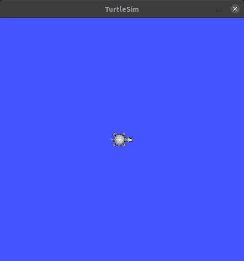

# TURTLEBOT3 TRAJECTORIES AND XACRO ARM
**Andru Liu**

## Overview 
Part 1 of this package has a simulated turtle follow a figure eight trajectory as well as the capability for a turtlebot3 to follow the same figure eight trajectory.

The package depends on `turtlesim` and `turtlebot3_description` (if you would like to simulate the turtlebot3 robot model). 

Part 2 of this package contains a xacro arm visualized in rviz, following a given trajectory. 

## Usage Instructions 
To launch the packages use the roslaunch command `roslaunch homework2 <launch_file>`.

The launch files are listed below:

`figure_eight.launch` - Launch file for running the robot following a figure eight trajectory. Use no arguments or add argument `mode:=sim` for simulating with turtlesim and add argument `mode:=real` for use on the turtlebot3.

To move the turtle, call the `resume` service with `rosservice call /resume`. To pause the turtle movement, call the `pause` service with `rosservice call /pause`. 

`arm_basics.launch` - Launch with no arguments or add `use_jsp:=False` for launching xacro arm to follow a trajectory. Add argument `use_jsp:=True` for launching with the joint state publisher gui to control the arm with the gui.

`arm_mark.launch` - Launch with no arguments or add `use_jsp:=False` for launching xacro arm to follow a trajectory with markers being placed. The marker shapes and colors correspond with positive or negative x position. Positive is a green sphere and negative is a blue cylinder. Add argument `use_jsp:=True` for launching with the joint state publisher gui to control the arm with the gui and still display the markers.

## Configuration Instructions
To adjust the trajectory parameters for the figure eight the turtle and robot will follow, use the `trajectory.yaml` file. The file takes parameters for width, height, and period of the figure eight. Use the commented suggested parameters for the turtlebot3. 

To adjust the publishing frequency of the cmd_vel messages, edit the launchfile private parameter `~pub_freq` in the file `launch/figure_eight.launch.

To adjust the parameters for the xacro arm, use the `arm.yaml` file. The file takes a length and radius for each link/arm and a period, T. 

Refer to python package `homework2/src/homework2` for symbolic calculations of the differential flatness equations and control inputs from the trajectory.

This package features a test option to test the values of the figure eight trajectory at a time of `t=0` and `t=T/2`. Use `catkin_make run_tests` to run these tests.

## Turtlesim Following Figure Eight
Turtle follows the trajectory starting from a paused state, resuming, and being paused and resumed again. 

## Turtlebot3 Robot Model Following Figure Eight 
Turlebot3 model follows the trajectory in RVIZ with the pause and resume services used again. 

## Turtlebot3 Robot Following Figure Eight 
Turtlebot3 robot follows the trajectory using the pause and resume services.

https://user-images.githubusercontent.com/90433630/137831334-9dec3fb7-2b72-49d3-af12-d19333610e8b.mp4

## Xacro Arm with Markers
Xacro arm following the trajectory with markers for x position 

