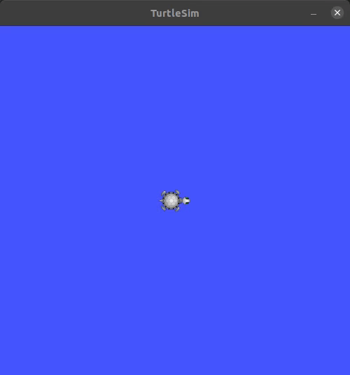
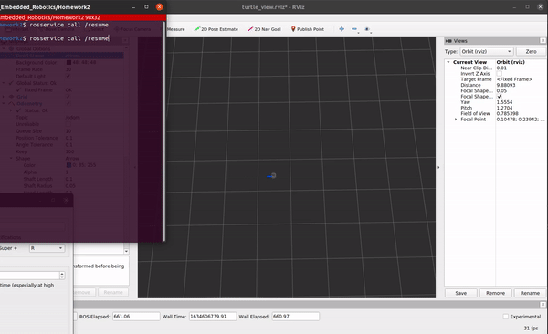

# TURTLE TRAJECTORIES AND XACRO ARM
**Andru Liu**

## Overview 
Part 1 of this package has a simulated turtle follow a figure eight trajectory as well as the capability for a turtlebot3 to follow the same figure eight trajectory.

The package depends on `turtlesim` and `turtlebot3_description` (if you would like to simulate the turtlebot3 robot model). 

Part 2 of this package contains a xacro arm visualized in rviz, following a given trajectory. 

## Usage Instructions 
To launch the packages use the roslaunch command `roslaunch homework2 <launch_file>`.

The launch files are listed below:

`figure_eight.launch` - Launch file for running the robot following a figure eight trajectory. Add argument `mode:=sim` for simulating with turtlesim and `mode:=real` for use on the turtlebot3.

`arm_basics.launch` - Launch with no arguments or add `use_jsp:=False` for launching xacro arm to follow a trajectory. Add argument `use_jsp:=True` for launching with the joint state publisher gui to control the arm with the gui.

`arm_mark.launch` - Launch with no arguments or add `use_jsp:=False` for launching xacro arm to follow a trajectory with markers being placed. The marker shapes and colors correspond with positive or negative x position. Positive is a green sphere and negative is a blue cylinder. Add argument `use_jsp:=True` for launching with the joint state publisher gui to control the arm with the gui and still display the markers.

## Configuration Instructions
To adjust the trajectory parameters for the figure eight the turtle and robot will follow, use the `trajectory.yaml` file. The file takes parameters for width, height, and period of the figure eight. Use the below suggested parameters for the turtlebot3. 

To adjust the parameters for the xacro arm, use the `arm.yaml` file. The file takes a length and radius for each link/arm and a period, T. 

Refer to python package `homework2/src/homework2` for symbolic calculations of the differential flatness equations and control inputs from the trajectory.   

## Turtlesim Following Figure Eight

## Turtlebot3 Robot Model Following Figure Eight 

## Turtlebot3 Robot Following Figure Eight 
